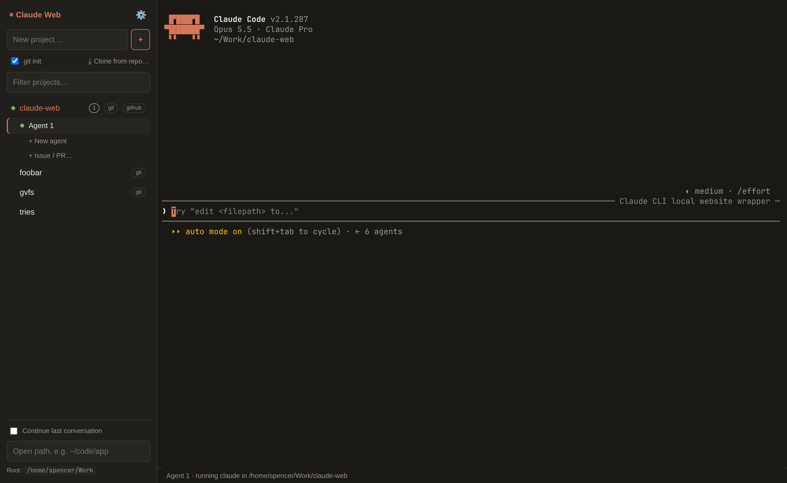
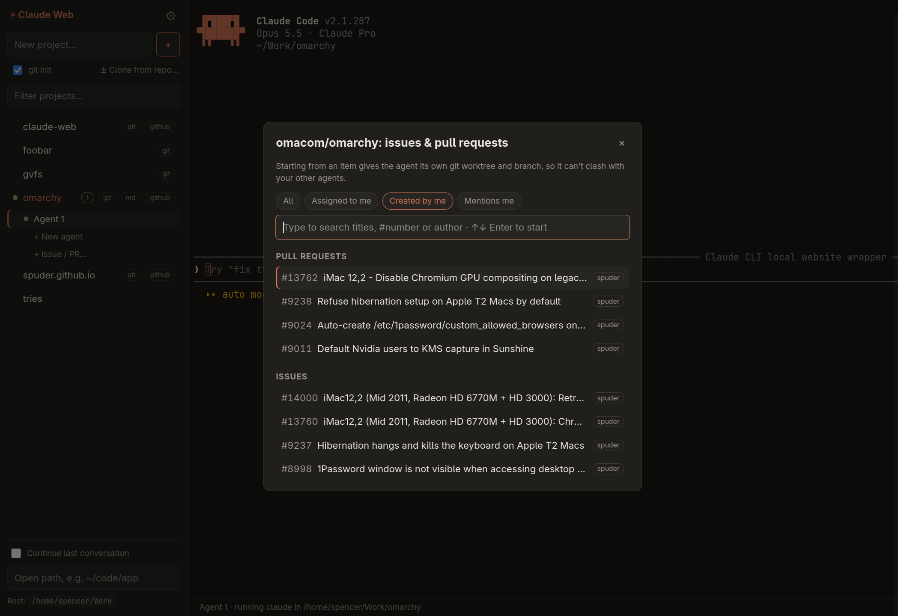

# Claude Web (proof of concept)

A local website that wraps the `claude` CLI: pick a project, get a real Claude Code
session in an in-browser terminal (xterm.js ↔ WebSocket ↔ node-pty).



```sh
npm install
npm start            # http://127.0.0.1:3456
```

Env vars:
- `PORT` (default `3456`)
- `PROJECTS_ROOT`: directory whose subfolders appear as projects (default `~/Work`)
- `CLAUDE_BIN`: path to the claude binary (default `claude` on PATH)
- `SETTINGS_FILE`: where integrations are stored (default `~/.config/claude-web/settings.json`)

## Integrations (GitHub, GitLab, Forgejo/Gitea)

Add a personal access token under ⚙ Settings. Then:

- **Clone from repo…** lists your repos, searches every repo on the forge, or takes a
  pasted `owner/repo` or URL. Cloning a fork offers to add its parent as the `upstream`
  remote.
- **Start agents from issues and PRs.** Projects on a connected forge get **+ Issue / PR…**
  under their agents. Filter to issues and PRs **assigned to you**, **created by you**, or
  **mentioning you**, search by title or `#number`, and pick one: Claude Web creates a
  dedicated git worktree for it and starts claude there with the issue or PR as its
  prompt. Each agent gets its own branch, so several can work in parallel without
  touching each other's files.



Worktrees live in `<root>/.worktrees/<project>/`: `issue-N` is a new branch (from
`upstream`'s default branch on forks, otherwise from HEAD) and `pr-N` is the PR's head.
For forks with an `upstream` remote, issues and PRs come from upstream. Worktrees are
kept after the agent closes; remove them with `git worktree remove`.

Tokens live only in the settings file (mode 600). They're never sent to the browser or
written into repos; git gets them through `GIT_CONFIG_*` env vars, and `gh`/`glab` get
`GH_TOKEN`/`GITLAB_TOKEN`, so agents can push or comment when you ask them to.

The server binds to 127.0.0.1 only and rejects cross-origin WebSocket connections,
since each session is a full agent with shell access. Not for exposing to a network.
